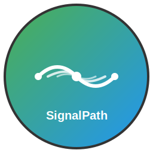

# SignalPath Intercom Designer

<div align="center">



**A professional intercom system designer and schematic editor for signal path visualization**

[](https://github.com/OmarAglan/SignalPath/releases)
[](https://github.com/OmarAglan/SignalPath/actions)
[](LICENSE)
[](https://github.com/OmarAglan/SignalPath/releases)

[Download Latest Release](https://github.com/OmarAglan/SignalPath/releases) • [Documentation](docs/) • [Changelog](CHANGELOG.md)

</div>

## ✨ Features

SignalPath Intercom Designer is a modern, cross-platform desktop application built for professional intercom system design and signal path visualization. The application combines an intuitive interface with powerful functionality to streamline your workflow.

### 🎯 Core Capabilities (Planned)

- **Professional Wiring System** - Complete wire drawing workflow with click-to-start, drag-to-route, click-to-finish functionality
- **Advanced Wire Routing** - Intelligent Manhattan routing with component boundary avoidance and 15px clearance
- **Pin Connection Management** - Visual pin indicators with click handlers and one-wire-per-pin validation
- **Real-time Connection Status** - Live properties panel showing pin connections, net IDs, and connected components
- **Rubber Band Wire Feedback** - Real-time visual wire preview following cursor during drawing
- **Component Avoidance Routing** - Sophisticated algorithms that route wires around component boundaries
- **Interactive Component Palette** - Comprehensive library of intercom system components with drag-and-drop functionality
- **Visual Canvas Editor** - Zoomable/pannable schematic design canvas with real-time feedback and component placement
- **Complete Component Interaction** - Professional selection, drag-to-move, properties editing, and deletion workflows
- **Component Lifecycle Management** - Full Place → Select → Move → Edit → Delete → Wire functionality with visual feedback
- **Enhanced Properties Panel** - Dynamic component and connection information with form-based editing and real-time updates
- **Professional Selection System** - Click-based component selection with visual highlighting and state management
- **Grid-Snapped Movement** - Smooth drag-to-move functionality with grid alignment and precise positioning
- **Multiple Deletion Methods** - Keyboard shortcuts (Delete/Backspace) and visual delete buttons for component removal
- **Schematic Symbol Rendering** - Professional schematic symbols with clickable pins for wire connections
- **Net Management System** - Complete electrical connectivity tracking with unique net IDs and connection arrays
- **State Management** - Real-time component and wiring state tracking with persistent schematic data
- **Interactive Design Surface** - Pan, zoom, and grid functionality for precise component positioning and wire routing

### 🛠️ Technical Highlights

- **Modern Architecture** - Built with Blazor WebAssembly, .NET 8, and Tauri
- **Advanced Wiring Engine** - Professional wire routing with component avoidance and Manhattan routing algorithms
- **Interactive Canvas** - HTML5 Canvas based zoomable/pannable design surface with real-time wire rendering
- **Component Pin System** - C#-based component definitions with clickable pin interfaces and position mapping
- **Net Management** - Complete electrical connectivity tracking with validation and real-time connection status
- **State Management** - C# singleton service with INotifyPropertyChanged for efficient application and wiring state handling
- **Professional Wire Routing** - Intelligent path planning with component boundary detection and clearance management
- **Real-time Validation** - One-wire-per-pin enforcement with visual feedback and connection status tracking
- **Cross-Platform** - Native desktop application for Windows, macOS, and Linux
- **Professional Packaging** - Code-signed installers with custom branding
- **Automated Updates** - Semantic versioning with automated release pipeline

## 💻 Installation

### Download Pre-built Applications

Download the latest version for your operating system from the [releases page](https://github.com/OmarAglan/SignalPath/releases):

| Platform | Download | Architecture |
|----------|----------|--------------|
| **Windows** | [NSIS Installer](https://github.com/OmarAglan/SignalPath/releases) | x64, x86 |
| **macOS** | [DMG Package](https://github.com/OmarAglan/SignalPath/releases) | Intel, Apple Silicon |
| **Linux** | [AppImage](https://github.com/OmarAglan/SignalPath/releases) / [DEB Package](https://github.com/OmarAglan/SignalPath/releases) | x64 |

### System Requirements

#### Windows

- Windows 10 or later
- 2GB RAM minimum
- 500MB disk space

#### macOS  

- macOS 10.15 (Catalina) or later
- 2GB RAM minimum
- 500MB disk space

#### Linux

- Ubuntu 18.04+ / Debian 10+ / Fedora 32+
- 2GB RAM minimum
- 500MB disk space

## 🏗️ Development

### Prerequisites

- **.NET 8 SDK** or later
- **Tauri CLI** for desktop application development
- **Git** for version control

### Quick Start

```bash
# Clone the repository
git clone https://github.com/OmarAglan/SignalPath.git
cd SignalPath

# Restore dependencies
dotnet restore

# Start development server
dotnet run --project src/Signalpath.csproj
```

### Development Commands

```bash
# Development
dotnet run --project src/Signalpath.csproj    # Start development server with hot reload
dotnet build                                    # Build for development
dotnet publish -c release src/Signalpath.csproj  # Build for production

# Tauri commands
tauri dev                                        # Start Tauri development environment
tauri build                                      # Build Tauri application
```

### Project Structure

```
SignalPath/
├── src/                          # Blazor application source
│   ├── Pages/                   # Blazor page components
│   │   ├── Canvas.razor         # Main design canvas
│   │   ├── ComponentPalette.razor # Component library with drag-and-drop
│   │   ├── PropertiesPanel.razor  # Properties and connection status panel
│   │   └── Home.razor           # Application home page
│   ├── Services/                # Application services
│   │   ├── ComponentLibrary.cs   # Component and pin definitions
│   │   └── SchematicState.cs     # Application state management
│   ├── Models/                  # Data models
│   │   ├── ComponentModel.cs    # Component and pin data models
│   │   ├── NetModel.cs          # Net and wire segment models
│   │   └── SchematicModel.cs    # Schematic and project models
│   ├── MainLayout.razor         # Main application layout
│   ├── App.razor               # Main application component
│   ├── Program.cs              # Application entry point
│   └── Signalpath.csproj       # Project file
├── src-tauri/                   # Tauri desktop application
│   ├── src/                    # Rust source code
│   ├── tauri.conf.json         # Tauri configuration
│   └── Cargo.toml              # Rust project configuration
├── public/                      # Static assets
│   ├── icons/                  # Component SVG icons
│   └── signalpath-icon.svg     # Application icon
├── docs/                        # Comprehensive documentation
├── .github/workflows/          # CI/CD automation
└── roadmap.md                   # Development roadmap
```

## 🏛️ Architecture

### Technology Stack

- **Frontend Framework**: Blazor WebAssembly with .NET 8
- **Desktop Runtime**: Tauri for lightweight, secure desktop applications
- **Canvas Rendering**: HTML5 Canvas API via JavaScript Interop
- **State Management**: C# singleton service with INotifyPropertyChanged for reactive updates
- **Wire Routing**: Custom algorithms with component avoidance and Manhattan routing
- **Build System**: .NET CLI with Tauri CLI for cross-platform distribution
- **Package Builder**: Tauri for native installers on all platforms
- **Development Tools**: .NET 8 SDK, Tauri CLI, Visual Studio/VS Code

### Key Design Decisions

- **.NET First** - Strong typing throughout the application including wiring interfaces using C#
- **Component Architecture** - Modular, reusable Blazor components with pin-based interaction
- **Professional Wire Routing** - Manhattan routing algorithms with component avoidance
- **Real-time State Management** - C# singleton service with INotifyPropertyChanged for efficient wiring and component state handling
- **Canvas-Based Rendering** - HTML5 Canvas for high-performance schematic visualization
- **Pin-Centric Design** - Component pins as first-class citizens for electrical connections
- **Tauri Security** - Context isolation and secure API access
- **Modern Tooling** - Fast development with .NET hot reload and Tauri development environment
- **Cross-Platform** - Native look and feel on each operating system with small binary size

## 🤝 Contributing

We welcome contributions to SignalPath! Here's how to get started:

### Development Workflow

1. **Fork** the repository
2. **Create** a feature branch: `git checkout -b feature/amazing-feature`
3. **Commit** using conventional commits: `git commit -m "feat: add amazing feature"`
4. **Push** to your branch: `git push origin feature/amazing-feature`
5. **Open** a Pull Request

### Code Quality

- Follow C# best practices and .NET coding conventions
- Maintain test coverage
- Use proper XML documentation for public methods
- Write clear, descriptive commit messages

## 📄 License

This project is licensed under the MIT License - see the [LICENSE](LICENSE) file for details.

## 👨‍💻 Author

**Omar Aglan**

- Email: <Omar.aglan91@gmail.com>
- GitHub: [@OmarAglan](https://github.com/OmarAglan)

## 🆘 Support

- **Issues**: [GitHub Issues](https://github.com/OmarAglan/SignalPath/issues)
- **Discussions**: [GitHub Discussions](https://github.com/OmarAglan/SignalPath/discussions)
- **Documentation**: [Project Documentation](docs/)

## 📈 Project Status


**Status**: ✅ **Phase 1 Complete - Foundation and Layout**

SignalPath has successfully completed Phase 1 of development, establishing a solid foundation for the Blazor + Tauri implementation:

- ✅ **Professional Application Layout** - Complete three-panel layout with toolbar, main content area, and status bar
- ✅ **Modern UI Framework** - Blazor WebAssembly with .NET 8 and Tauri desktop integration
- ✅ **Component Structure** - Proper Blazor component architecture with MainLayout and page components
- ✅ **State Management Foundation** - C# singleton service with INotifyPropertyChanged for reactive updates
- ✅ **Data Models** - Comprehensive data models for components, pins, nets, and schematic elements
- ✅ **Dependency Injection** - Proper .NET dependency injection with services registration
- ✅ **Responsive Design** - Professional UI with dark mode support and responsive layout
- ✅ **Component Library Service** - Foundation for component definitions and management
- ✅ **Development Environment** - Fully functional development and build system

**Current Capabilities**: The application now has a professional foundation with a working three-panel layout, state management system, and modern Blazor + Tauri architecture. The UI includes a functional toolbar, status bar, and home page. The application is ready for Phase 2 development, which will focus on implementing the component library and canvas placement functionality.

---

<div align="center">

**Built with ❤️ using Blazor, .NET 8, and Tauri**

[⬆ Back to Top](#signalpath-intercom-designer)

</div>
